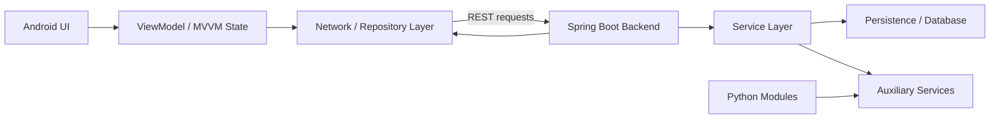
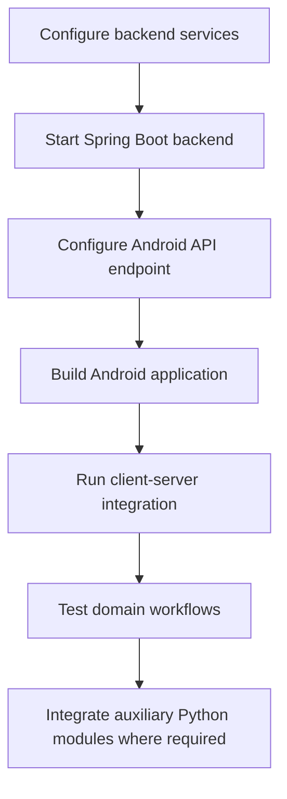

<div align="center">

# HealthCare V2 — 守护天使
### Full-Stack Healthcare Application · Spring Boot + Android MVVM


</div>

## Overview

**HealthCare V2 / 守护天使** is a collaborative healthcare-oriented software system developed for **EE311** and a software innovation & entrepreneurship competition. Compared with the earlier HealthCare repository, this version is organized as a more complete multi-component application with a dedicated backend, Android frontend, auxiliary Python code, and competition presentation materials.

The project follows a client–server architecture: an Android application based on **MVVM** communicates with a Java **Spring Boot** backend, while the repository also preserves a separate `Python_part/` for auxiliary functionality developed during the project.

## Team

**Bo Liu, Sun Xun, Lin Wei, Wu Jingqiang, Han Derong, Li Yiyang, Su Rongzeng, Lin Yanxu**

This repository represents a team project. The README intentionally preserves the collaborative nature of the work rather than presenting it as a single-author system.

## Architecture



## Repository Layout

```text
HealthCare_V2/
├── HC_back_end/          # Java / Spring Boot backend
├── HC_front_end/         # Android client using MVVM-style architecture
├── Python_part/          # Auxiliary Python code from the original project
├── PPT.pptx              # Competition / project presentation
└── README.md
```

The original competition presentation can be opened directly from [`PPT.pptx`](PPT.pptx) for additional project context and screenshots from the development period.

## Technical Scope

### Backend

The backend is responsible for service APIs, business logic, authentication/data access, and communication with the Android client. It represents the server side of the application and should be configured first when reproducing the original system.

### Android Client

The Android module is organized around an **MVVM** design, separating UI rendering, state/business logic, and data/network access. This architecture was used to make the mobile client easier to maintain and coordinate within the team.

### Python Components

`Python_part/` contains auxiliary Python-side work from the original project. Because this is a historical repository, the Python code is preserved in its original project context rather than being repackaged as a standalone library.

## Development Workflow



## Getting Started

### Backend

Enter `HC_back_end/`, inspect its Maven/Gradle configuration and application settings, then configure the local database and service endpoints used by the original implementation.

Typical Spring Boot workflow:

```bash
mvn clean package
mvn spring-boot:run
```

### Android Frontend

1. Open `HC_front_end/` in Android Studio.
2. Let Gradle synchronize the project.
3. Update the backend host / API address to match your local deployment.
4. Build and run on an emulator or Android device.

### Python Part

Inspect `Python_part/` for the original dependencies and entry scripts before execution. Local paths and model/data dependencies may need to be adapted.

## What This Project Demonstrates

- Multi-person software-engineering collaboration.
- Client–server architecture design.
- Android application development with MVVM concepts.
- Java Spring Boot backend development.
- API integration between mobile and server components.
- Multi-language project organization across Java/Kotlin/Python-oriented components.
- Competition-oriented documentation and presentation.

## Historical / Reproduction Notes

This repository reflects the dependency versions, build files, service addresses, and local configuration of the original development period. A modern reproduction may require dependency upgrades and replacement of machine-specific settings. The code is kept in its original form to preserve the engineering history of the project.

## Portfolio Context

HealthCare V2 belongs to my earlier software-engineering experience before my research shifted toward **graph learning, spatiotemporal intelligence, LLM-based semantic reasoning, and Agentic AI**. It remains part of the portfolio because it demonstrates system integration and team-development experience complementary to my later research work.

## Contact

For questions about this repository, please contact **Bo Liu** at `liubo317@hnu.edu.cn`.  
Homepage: https://boliupro.github.io
